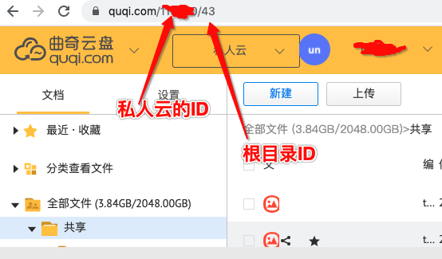

# 用途
将曲奇网盘的API转成webdav服务

下面的 QUQI_CLOUD_ID和QUQI_ROOT_DIR_ID需要自己登录网页版，在URL里面找出，第一个数子是QUQI_CLOUD_ID，第二个数字是QUQI_ROOT_DIR_ID

# 用法
```
npm install

export QUQI_ACCOUNT=18*********
export QUQI_PASSWORD=*******
export QUQI_CLOUD_ID=*******
export QUQI_ROOT_DIR_ID=**********

npm start

```


## TODO
- [x] 列出子目录
- [x] 下载1G文件
- [x] 重命名
- [x] 上传1G文件
- [x] 上传目录
- [x] 极速上传
- [x] 删除文件
- [x] 新建目录
- [x] token不正确时自动注销
- [x] 文件修改时间
- [x] 自动遍历上级目录

监听端口：tcp:1900
webdav账号：admin
webdav密码：admin
